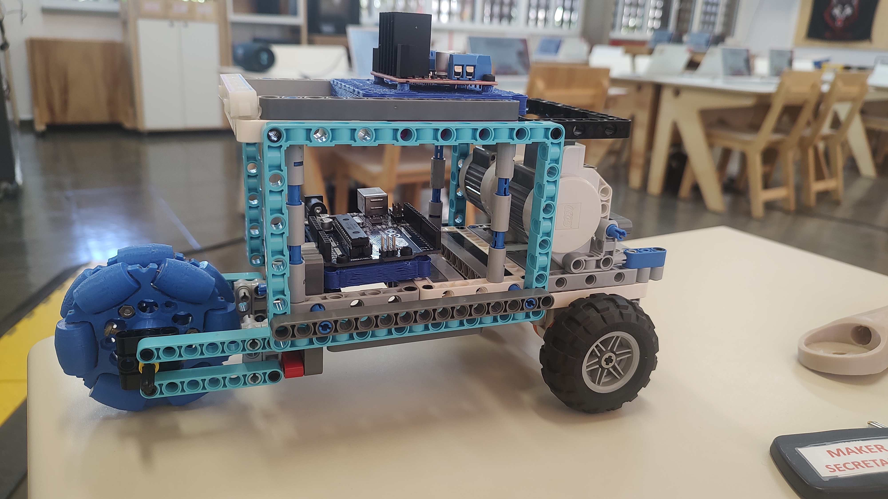
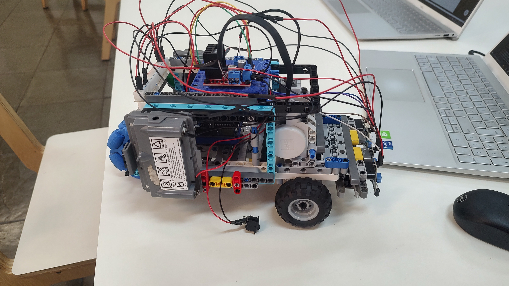
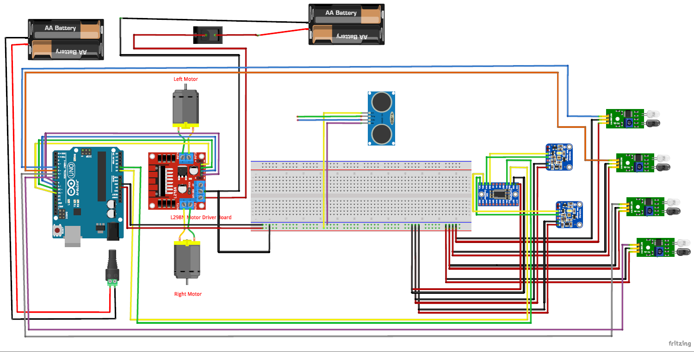

# 🤖 Robô Seguidor de Linha 2026 - Projeto Maker SESI

Este projeto, coordenado pelo Luiz Loureiro e auxiliado por mim, consiste em um upgrade para o robô seguidor de linha desenvolvido em 2025 por alunos do SESI na sala Maker. O robô utiliza sensores infravermelhos para seguir trajetos pretos em superfícies claras e sensores de cor TCS34725 para realizar ações especiais ao detectar marcadores coloridos (como giros de 90° ou 180° ao detectar a cor verde e parar ao detectar vermelho).

## 🚀 Objetivo

Criar um robô autônomo usando arduino e estrutura lego capaz de percorrer trajetos pré-definidos com curvas e ramificações, reagindo a estímulos visuais como linhas e cores.
Entrar para o pódio no Nível 2 da OBR 2026.

---

## 🛠️ Tecnologias e Componentes

- **Arduino Uno**
- **Motores Lego NXT com driver ponte H**
- **Sensores de linha (analógicos)**
- **Sensores de cor TCS34725**
- **Sensor ultrassônico**
- **Multiplexador TCA9548A (para usar múltiplos sensores I2C)**
- **Acelerômetro**
- **Estrutura em Lego**
- **Bateria Li-Ion ou Pack de pilhas**

---

## 📷 Imagens do Projeto

### 🧠 Estrutura e Montagem

**Versão 1 da Nova Carcaça:**

---

**Robô V1 com fios conectados:**

---

## 👨‍💻 Funcionamento do Código

- Controle da linha por **PID** com ajuste dinâmico de velocidade.
- Detecta cor verde nos sensores RGB para acionar giros fechados.
- Lógica **não bloqueante** com `millis()` para permitir leitura contínua de sensores e movimento fluido.
- Log detalhado no **Serial Monitor** para visualização de sensores e resposta do PID.

---

## 🤖⚙️ Esquema de montagem para os fios

---

## 🧪 Como usar

1. Conecte os componentes de acordo com o esquema de montagem.
2. Carregue o código no Arduino usando a IDE Arduino.
3. Alimente o robô com a bateria e coloque-o na pista.
4. Use o **Serial Plotter** para visualizar os dados em tempo real (opcional).

---

## 👥 Equipe

| Nome               | Função                         |
|--------------------|--------------------------------|
| Luiz Loureiro      | Supervisor, Pesquisador, Programador e  Montagem   |
| Estevão F. Cruz     | Auxiliar, Pesquisador, Programador, Montagem e Testes              |
| Guilherme Malta    | Pesquisador, Montagem, Testes e Programador        |
| João Pedro         | Pesquisador e Programador        |
| Vitor              | Pesquisador e Montagem        |
| Emanuel            | Pesquisador e Programador       |

---

## 📚 Licença

Este projeto está licenciado sob a [MIT License](LICENSE).

---

## ✨ Agradecimentos

Agradecemos ao SESI e pelo apoio e incentivo na construção desse projeto.

---

